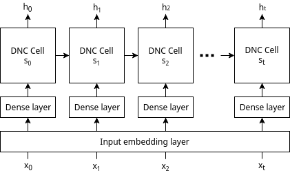
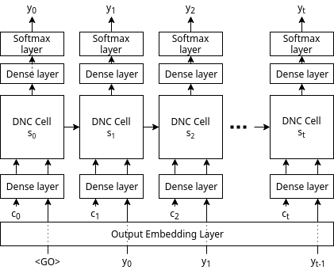

# Text Normalization using Memory Augmented Neural Networks

The 'Text Normalization Demo' notebook and the accompanying paper "<a href="https://storage.googleapis.com/ainstein_text_normalization/Text%20Normalization%20using%20Memory%20Augmented%20Neural%20Network%20(arXiV%20preprint).pdf">Text Normalization using Memory Augmented Neural Networks</a>" demonstrates an accuracy of 99.5% on the Text Normalization Challenge by Richard Sproat and Navdeep Jaitly. The approach used here has secured the 6th position in the [Kaggle Russian Text Normalization Challenge](https://www.kaggle.com/c/text-normalization-challenge-russian-language) by Google's Text Normalization Research Group.

## Architecture
Two models are used for the purpose of text normalization. An XGBoost boost model first classifies a token to to-be-normalized or remain-self. The to-be-normalized tokens are then fed character-by-character to our proposed Sequence to Sequence DNC model. 

More details about the architecture and implementation can be found in the original paper.

<center>
	
**Sequence to sequence DNC, encoding phase**



**Sequence to sequence DNC, decoding phase**



</center>	

## Results : 

### 1. Normalizing English Data 

<center>

**Semiotic Classwise Accuracy**

|    | semiotic-class | accuracy | count | correct |
|----|----------------|----------|-------|---------|
| 0  | ALL            | 0.994137 | 92451 | 91909   |
| 1  | ADDRESS        | 1.000000 | 4     | 4       |
| 2  | CARDINAL       | 0.989392 | 1037  | 1026    |
| 3  | DATE           | 0.997881 | 2832  | 2826    |
| 4  | DECIMAL        | 1.000000 | 92    | 92      |
| 5  | DIGIT          | 0.795455 | 44    | 35      |
| 6  | ELECTRONIC     | 0.734694 | 49    | 36      |
| 7  | FRACTION       | 0.687500 | 16    | 11      |
| 8  | LETTERS        | 0.971611 | 1409  | 1369    |
| 9  | MEASURE        | 0.964789 | 142   | 137     |
| 10 | MONEY          | 0.945946 | 37    | 35      |
| 11 | ORDINAL        | 0.951456 | 103   | 98      |
| 12 | PLAIN          | 0.993873 | 67894 | 67478   |
| 13 | PUNCT          | 0.998873 | 17746 | 17726   |
| 14 | TELEPHONE      | 0.918919 | 37    | 34      |
| 15 | TIME           | 0.750000 | 8     | 6       |
| 16 | VERBATIM       | 0.995005 | 1001  | 996     |

</center>

### 2. Normalizing Russian Data

**Semiotic Classwise Accuracy**

<center>

|    | semiotic-class | accuracy | count | correct |
|----|----------------|----------|-------|---------|
| 0  | ALL            | 0.993025 | 93196 | 92546   |
| 1  | CARDINAL       | 0.941374 | 2388  | 2248    |
| 2  | DATE           | 0.975251 | 1495  | 1458    |
| 3  | DECIMAL        | 0.900000 | 60    | 54      |
| 4  | DIGIT          | 1.000000 | 16    | 16      |
| 5  | ELECTRONIC     | 0.583333 | 48    | 28      |
| 6  | FRACTION       | 0.652174 | 23    | 15      |
| 7  | LETTERS        | 0.990761 | 1840  | 1823    |
| 8  | MEASURE        | 0.888078 | 411   | 365     |
| 9  | MONEY          | 0.894737 | 19    | 17      |
| 10 | ORDINAL        | 0.955504 | 427   | 408     |
| 11 | PLAIN          | 0.994920 | 64764 | 64435   |
| 12 | PUNCT          | 0.999852 | 20264 | 20261   |
| 13 | TELEPHONE      | 0.786517 | 89    | 70      |
| 14 | TIME           | 0.750000 | 8     | 6       |
| 15 | VERBATIM       | 0.998512 | 1344  | 1342    |

</center>

## How to run?

**Requirements:**
- [Jupyter Notebook](http://jupyter.org/) 
- [Anaconda Package Manager](https://anaconda.org/)
- rest will be installed by anaconda (see below)

**Follow these steps for a demonstration:**

1. Clone the repo
2. Download and extract the required data.
```
$ sh setup.sh
```
2. Create & activate an environment using the provided file
```
$ conda env create -f environment.yml
$ source activate deep-tf
```
3. Start a Jupyter Notebook server
4. Open 'notebooks/Text Normalization Demo.ipynb'
5. Set the language to English or Russian below the 'Global Config' cell
```python
lang = 'english'
# lang = 'russian'
```
6. Run the notebook

**Full Requirements:**

- numpy 1.13.3
- pandas 0.21.0
- matplotlib 2.1.0
- watermark 1.5.0
- seaborn 0.8.1
- sklearn 0.19.1
- xgboost 0.6
- tensorflow 1.3.0

## Authors
1. Subhojeet Pramanik (http://github.com/subho406)
2. Aman Hussain (https://github.com/AmanDaVinci)

**Aknowledgements**

Differentiable Neural Computer, Tensorflow Implementation: https://github.com/deepmind/dnc