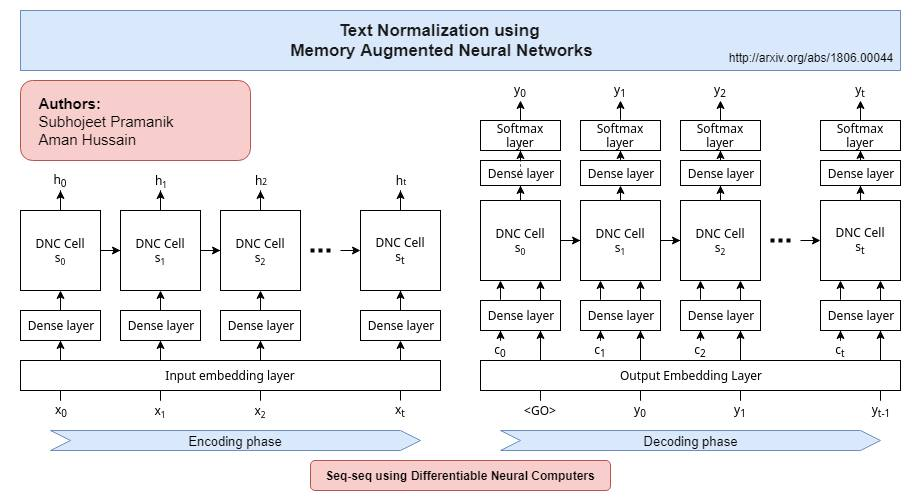

# Text Normalization using Memory Augmented Neural Networks

The 'Text Normalization Demo' notebook and the accompanying paper "<a href="http://arxiv.org/abs/1806.00044">Text Normalization using Memory Augmented Neural Networks</a>" demonstrates an accuracy of 99.5% on the Text Normalization Challenge by Richard Sproat and Navdeep Jaitly. An earlier version of the approach used here has secured the 6th position in the [Kaggle Russian Text Normalization Challenge](https://www.kaggle.com/c/text-normalization-challenge-russian-language) by Google's Text Normalization Research Group.

## Architecture
Two models are used for the purpose of text normalization. An XGBoost boost model first classifies a token to to-be-normalized or remain-self. The to-be-normalized tokens are then fed character-by-character to our proposed Sequence to Sequence DNC model. 

More details about the architecture and implementation can be found in the original paper.

<center>
	
**Sequence to sequence DNC**




</center>	

## Results : 

### 1. Normalizing English Data 

<center>

**Semiotic Classwise Accuracy**

| semiotic-class | accuracy           | count | correct |
|----------------|--------------------|-------|---------|
| ALL            | 0.994267233453397  | 92451 | 91921   |
| ADDRESS        | 1.0                | 4     | 4       |
| CARDINAL       | 0.9942140790742526 | 1037  | 1031    |
| DATE           | 0.9971751412429378 | 2832  | 2824    |
| DECIMAL        | 0.9891304347826086 | 92    | 91      |
| DIGIT          | 0.7954545454545454 | 44    | 35      |
| ELECTRONIC     | 0.7346938775510204 | 49    | 36      |
| FRACTION       | 0.6875             | 16    | 11      |
| LETTERS        | 0.971611071682044  | 1409  | 1369    |
| MEASURE        | 0.971830985915493  | 142   | 138     |
| MONEY          | 0.972972972972973  | 37    | 36      |
| ORDINAL        | 0.9805825242718447 | 103   | 101     |
| PLAIN          | 0.9939611747724394 | 67894 | 67484   |
| PUNCT          | 0.9988729854615125 | 17746 | 17726   |
| TELEPHONE      | 0.918918918918919  | 37    | 34      |
| TIME           | 0.75               | 8     | 6       |
| VERBATIM       | 0.994005994005994  | 1001  | 995     |

</center>

### 2. Normalizing Russian Data

**Semiotic Classwise Accuracy**

<center>

| semiotic-class | accuracy           | count | correct |
|----------------|--------------------|-------|---------|
| ALL            | 0.9928752306965964 | 93196 | 92532   |
| CARDINAL       | 0.9417922948073701 | 2388  | 2249    |
| DATE           | 0.9732441471571907 | 1495  | 1455    |
| DECIMAL        | 0.9                | 60    | 54      |
| DIGIT          | 1.0                | 16    | 16      |
| ELECTRONIC     | 0.6041666666666666 | 48    | 29      |
| FRACTION       | 0.6086956521739131 | 23    | 14      |
| LETTERS        | 0.9907608695652174 | 1840  | 1823    |
| MEASURE        | 0.8978102189781022 | 411   | 369     |
| MONEY          | 0.8947368421052632 | 19    | 17      |
| ORDINAL        | 0.9461358313817331 | 427   | 404     |
| PLAIN          | 0.994688407139769  | 64764 | 64420   |
| PUNCT          | 0.9998519542045006 | 20264 | 20261   |
| TELEPHONE      | 0.8202247191011236 | 89    | 73      |
| TIME           | 0.75               | 8     | 6       |
| VERBATIM       | 0.9985119047619048 | 1344  | 1342    |

</center>

## How to run?

**Requirements:**
- [Jupyter Notebook](http://jupyter.org/) 
- [Anaconda Package Manager](https://anaconda.org/)
- rest will be installed by anaconda (see below)

**Follow these steps for a demonstration:**

1. Clone the repo
2. Download and extract the required data.
```
$ sh setup.sh
```
2. Create & activate an environment using the provided file
```
$ conda env create -f environment.yml
$ source activate deep-tf
```
3. Start a Jupyter Notebook server
4. Open 'notebooks/Text Normalization Demo.ipynb'
5. Set the language to English or Russian below the 'Global Config' cell
```python
lang = 'english'
# lang = 'russian'
```
6. Run the notebook

**Full Requirements:**

- numpy 1.13.3
- pandas 0.21.0
- matplotlib 2.1.0
- watermark 1.5.0
- seaborn 0.8.1
- sklearn 0.19.1
- xgboost 0.6
- tensorflow 1.3.0

## Authors
1. Subhojeet Pramanik (http://github.com/subho406)
2. Aman Hussain (https://github.com/AmanDaVinci)

**Aknowledgements**

Differentiable Neural Computer, Tensorflow Implementation: https://github.com/deepmind/dnc
