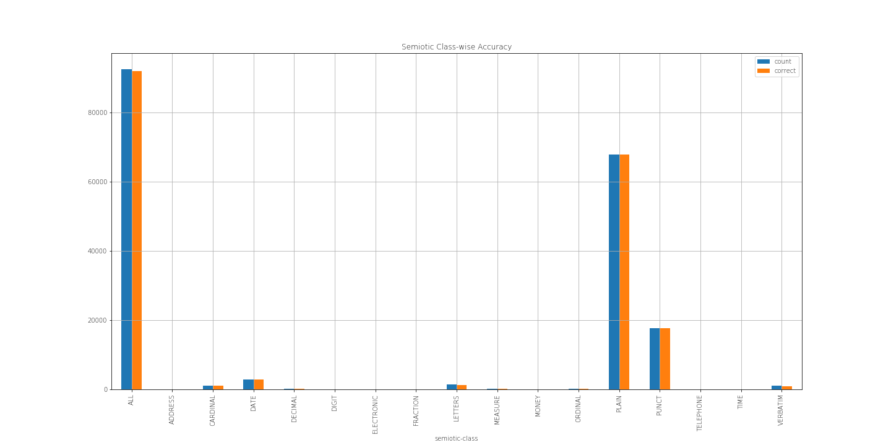

# Text Normalization using Memory Augmented Neural Networks

The text-normalization-demo notebook and the accompanying paper "Text Normalization using Memory Augmented Neural Networks" (paper under review) demonstrates an accuracy of 99.5% on the Text Normalization Challenge by Richard Sproat and Navdeep Jaitly. The approach used here has secured the 6th position in the [Kaggle Russian Text Normalization Challenge](https://www.kaggle.com/c/text-normalization-challenge-russian-language) by Google's Text Normalization Research Group.

## Architecture
Two models are used for the purpose of text normalization. An XGBoost boost model first classifies a token to to-be-normalized or remain-self. The to-be-normalized tokens are then fed character-by-character to our proposed Sequence to Sequence DNC model. 

More details about the architecture and implementation can be found in the original paper.

<center>
**Sequence to sequence DNC, encoding phase**


**Sequence to sequence DNC, decoding phase**


</center>
## Results : Normalizing English Data 



<center>

**Semiotic Classwise Accuracy**

|    | semiotic-class | accuracy | count | correct | 
|----|----------------|----------|-------|---------| 
| 0  | ADDRESS        | 1.0      | 4     | 4.0     | 
| 1  | CARDINAL       | 0.9913   | 1037  | 1028.0  | 
| 2  | DATE           | 0.9975   | 2832  | 2825.0  | 
| 3  | DECIMAL        | 1.0      | 92    | 92.0    | 
| 4  | DIGIT          | 0.8636   | 44    | 38.0    | 
| 5  | ELECTRONIC     | 0.0      | 49    | 0.0     | 
| 6  | FRACTION       | 0.625    | 16    | 10.0    | 
| 7  | LETTERS        | 0.9318   | 1409  | 1313.0  | 
| 8  | MEASURE        | 0.9718   | 142   | 138.0   | 
| 9  | MONEY          | 0.9459   | 37    | 35.0    | 
| 10 | ORDINAL        | 0.9514   | 103   | 98.0    | 
| 11 | PLAIN          | 0.9983   | 67894 | 67785.0 | 
| 12 | PUNCT          | 0.9995   | 17746 | 17738.0 | 
| 13 | TELEPHONE      | 0.9189   | 37    | 34.0    | 
| 14 | TIME           | 0.75     | 8     | 6.0     | 
| 15 | VERBATIM       | 0.8741   | 1001  | 875.0   | 

</center>

## How to run?
---

**Requirements:**
- [Jupyter Notebook](http://jupyter.org/) 
- [Anaconda Package Manager](https://anaconda.org/)
- rest will be installed by anaconda (see below)

**Follow these steps for a demonstration:**

1. Clone the repo
2. Create & activate an environment using the provided file
```
$ conda env create -f environment.yml
$ source activate deep-tf
```
3. Start a Jupyter Notebook server
4. Open 'notebooks/text-normalization-demo.ipynb'
5. Set the language to English or Russian below the 'Global Config' cell
```python
lang = 'english'
# lang = 'russian'
```
6. Run the notebook

**Full Requirements:**

- numpy 1.13.3
- pandas 0.21.0
- matplotlib 2.1.0
- watermark 1.5.0
- seaborn 0.8.1
- sklearn 0.19.1
- xgboost 0.6
- tensorflow 1.3.0

**Authors**
1. Subhojeet Pramanik
2. Aman Hussain
